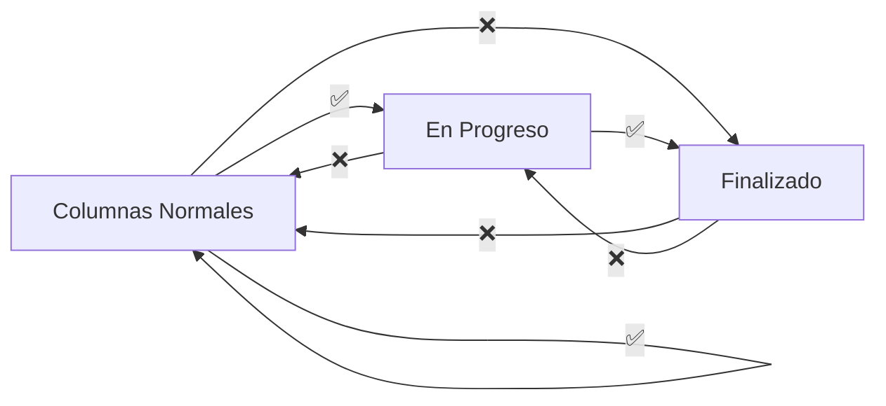

# 📋 Respuestas del Backend para Frontend - Sistema Kanban

**Fecha:** 5 de noviembre de 2025  
**Versión Backend:** PHP 8.1 con Slim Framework  
**Base de Datos:** MySQL 8.0

---

## 1️⃣ ¿El Backend Valida las Reglas de Movimiento?

### ✅ SÍ, el backend valida TODAS las reglas

**Archivos:**
- `src/Conduit/Controllers/Tarea/TareaController.php`
  - Método `move()` (línea 256)
  - Método `bulkMove()` (línea 365)

**Reglas Implementadas:**

| Origen | Destino | Resultado |
|--------|---------|-----------|
| Normal | Normal | ✅ Permitido |
| Normal | En Progreso (`status_fijas='1'`) | ✅ Permitido |
| Normal | Finalizado (`status_fijas='2'`) | ❌ **Error 400** |
| En Progreso | Finalizado | ✅ Permitido |
| En Progreso | Normal | ❌ **Error 400** |
| Finalizado | Cualquiera | ❌ **Error 400** |

**⚠️ IMPORTANTE:** El API **NO confía** en el frontend. Siempre valida las reglas en el servidor.

---

## 2️⃣ Valores de `status_fijas` en la Base de Datos

### Tipo de Dato en MySQL:
```sql
status_fijas ENUM('1', '2') NULL DEFAULT NULL
```

### ✅ Se guarda como STRING
- `'1'` = En Progreso
- `'2'` = Finalizado
- `NULL` = Columna normal (sin status fijo)

### ⚠️ NULL vs String Vacío
- Cuando es `NULL`, la API devuelve `null` (no `""`)
- **NO** comparar con `0` o números en frontend

### Constantes en `Columna.php`:
```php
const STATUS_FIJA_PROGRESO = '1';    // STRING
const STATUS_FIJA_FINALIZADO = '2';  // STRING
```

---

## 3️⃣ Respuesta del Endpoint de Columnas

### Endpoint:
```
GET /proyectos/{id}/columnas
```

### ✅ `status_fijas` SIEMPRE se devuelve
Incluso si es `null`, el campo está presente en el JSON.

### Ejemplo de Respuesta:
```json
{
  "columnas": [
    {
      "id_columna": 2,
      "id_proyecto": 1,
      "nombre": "Por Hacer",
      "color": null,
      "posicion": 0,
      "tipo_columna": "normal",
      "status_fijas": null,         // ← SIEMPRE presente, puede ser null
      "status": "0",
      "created_at": "2025-11-05T12:00:00+00:00",
      "updated_at": "2025-11-05T12:00:00+00:00"
    },
    {
      "id_columna": 3,
      "id_proyecto": 1,
      "nombre": "En Progreso",
      "color": "#3498db",
      "posicion": 1,
      "tipo_columna": "fija",
      "status_fijas": "1",          // ← STRING, no número
      "status": "0",
      "created_at": "2025-11-05T12:00:00+00:00",
      "updated_at": "2025-11-05T12:00:00+00:00"
    },
    {
      "id_columna": 4,
      "id_proyecto": 1,
      "nombre": "Hecho",
      "color": "#2ecc71",
      "posicion": 2,
      "tipo_columna": "fija",
      "status_fijas": "2",          // ← STRING
      "status": "0",
      "created_at": "2025-11-05T12:00:00+00:00",
      "updated_at": "2025-11-05T12:00:00+00:00"
    }
  ]
}
```

**Archivo:** `src/Conduit/Transformers/ColumnaTransformer.php` (línea 48)

---

## 4️⃣ Restricción de Eliminación de Tareas

### ✅ DELETE `/tareas/{id}` SIN restricciones

**Se puede eliminar desde:**
- ✅ Columnas normales
- ✅ En Progreso (`status_fijas='1'`)
- ✅ Finalizado (`status_fijas='2'`)

**Archivo:** `TareaController.php` método `destroy()` (línea 247)

```php
public function destroy(Request $req, Response $res, array $args): Response
{
    $ok = $this->svc->delete((int)$args['id']);
    return $ok
        ? $this->json($res, ['message' => 'Tarea eliminada correctamente.'])
        : $this->json($res, ['error' => 'La tarea no existe o ya fue eliminada.'], 404);
}
```

### 💡 Nota Importante:
**La eliminación es la ÚNICA forma de vaciar columnas "En Progreso" o "Finalizado"** para poder cambiar su `status_fijas`.

---

## 5️⃣ Cambio de `status_fijas` y `tipo_columna` con Tareas

### 📋 Reglas según el tipo y estado de la columna:

---

### 🆕 Caso 1: Columna NORMAL → FIJA (asignar status_fijas)
**Condición:** `tipo_columna='normal'` y `status_fijas=NULL`

✅ **SE PUEDE** asignar `status_fijas` **AUNQUE tenga tareas**

**Ejemplo:**
```
Columna "Por Hacer" (tipo_columna='normal', status_fijas=NULL) con 5 tareas
→ Cambiar a tipo_columna='fija' y status_fijas='1' ✅ PERMITIDO
→ Las 5 tareas se quedan en la columna
```

**💡 Razón:** Es la primera vez que se establece un status fijo, se permite la conversión.

---

### 🔄 Caso 2: Columna FIJA → Cambiar status_fijas ('1' ↔ '2')
**Condición:** `tipo_columna='fija'` y `status_fijas='1'` o `'2'`

❌ **NO se puede cambiar** `status_fijas` si tiene tareas  
✅ **SE PUEDE cambiar** si NO tiene tareas

**Ejemplos:**
```
Columna "tet" (tipo_columna='fija', status_fijas='1') con 3 tareas
→ Cambiar a status_fijas='2' ❌ ERROR 400
→ Debe eliminar las 3 tareas primero

Columna "tet" (tipo_columna='fija', status_fijas='1') con 0 tareas
→ Cambiar a status_fijas='2' ✅ PERMITIDO
```

**💡 Razón:** Ya es una columna fija, cambiar su tipo afectaría las métricas y el flujo.

---

### 🔙 Caso 3: Columna FIJA → NORMAL (quitar status_fijas)
**Condición:** `tipo_columna='fija'` y `status_fijas='1'` o `'2'`

❌ **NO se puede cambiar a normal** si tiene tareas  
✅ **SE PUEDE cambiar a normal** si NO tiene tareas

**Ejemplos:**
```
Columna "Hecho" (tipo_columna='fija', status_fijas='2') con 10 tareas
→ Cambiar a tipo_columna='normal' y status_fijas=NULL ❌ ERROR 400
→ Debe eliminar las 10 tareas primero

Columna "Hecho" (tipo_columna='fija', status_fijas='2') con 0 tareas
→ Cambiar a tipo_columna='normal' y status_fijas=NULL ✅ PERMITIDO
```

**💡 Razón:** Las tareas en columnas fijas tienen significado específico (en progreso/completadas), no se pueden "degradar" a normal con tareas.

---

### 📊 Tabla Resumen de Cambios Permitidos:

| Estado Actual | Cambio Deseado | Con Tareas | Sin Tareas |
|---------------|----------------|------------|------------|
| Normal (NULL) | → Fija ('1' o '2') | ✅ Permitido | ✅ Permitido |
| Fija ('1') | → Fija ('2') | ❌ Bloqueado | ✅ Permitido |
| Fija ('2') | → Fija ('1') | ❌ Bloqueado | ✅ Permitido |
| Fija ('1' o '2') | → Normal (NULL) | ❌ Bloqueado | ✅ Permitido |

**Archivo:** `ColumnaController.php` método `gestionarTipos()` (línea 459)

---

### 🔑 Flujos Completos:

#### Convertir Normal a Fija:
1. Columna normal con tareas → Asignar status_fijas directamente ✅
2. Las tareas permanecen en la columna

#### Cambiar status_fijas en Fija:
1. Eliminar todas las tareas de la columna
2. Cambiar el `status_fijas` ('1' ↔ '2')
3. Mover tareas desde otras columnas

#### Convertir Fija a Normal:
1. Eliminar todas las tareas de la columna
2. Cambiar a `tipo_columna='normal'` y `status_fijas=NULL`
3. Ahora puede recibir tareas de cualquier columna normal

---

## 6️⃣ Dashboard y Métricas

### ⚠️ NO HAY ENDPOINT DE MÉTRICAS implementado actualmente

### 📊 Lógica Sugerida (si se implementa):

```sql
-- Tareas pendientes (en columnas normales)
SELECT COUNT(*) FROM tareas t
INNER JOIN columnas c ON t.id_columna = c.id_columna
WHERE c.id_proyecto = ? 
  AND c.status_fijas IS NULL
  AND t.status = '0';

-- Tareas en progreso
SELECT COUNT(*) FROM tareas t
INNER JOIN columnas c ON t.id_columna = c.id_columna
WHERE c.id_proyecto = ? 
  AND c.status_fijas = '1'
  AND t.status = '0';

-- Tareas completadas
SELECT COUNT(*) FROM tareas t
INNER JOIN columnas c ON t.id_columna = c.id_columna
WHERE c.id_proyecto = ? 
  AND c.status_fijas = '2'
  AND t.status = '0';
```

### 💡 Sugerencia para Backend:
Crear endpoint `GET /proyectos/{id}/metricas` en `ProyectoController.php`

**Respuesta esperada:**
```json
{
  "metricas": {
    "tareas_pendientes": 15,
    "tareas_en_progreso": 8,
    "tareas_completadas": 42,
    "total_tareas": 65
  }
}
```

---

## 🚫 Mensajes de Error del API

### Errores de Movimiento (HTTP 400)

| Situación | Mensaje |
|-----------|---------|
| Normal → Finalizado | `"Las tareas deben pasar primero por \"En Progreso\" antes de ser finalizadas."` |
| En Progreso → Normal | `"Las tareas en progreso solo pueden moverse a la columna finalizada."` |
| Finalizado → Cualquiera | `"No se puede mover una tarea desde una columna finalizada."` |
| Límite de tareas | `"No se puede mover la tarea: la columna destino ya tiene el máximo de {X} tareas activas."` |

### Errores de Cambio de `status_fijas` (HTTP 400)

| Situación | Mensaje |
|-----------|---------|
| Cambiar con tareas | `"No se puede cambiar de [STATUS_ACTUAL] a [STATUS_NUEVO] si la columna tiene tareas activas."` |

### Estructura de Error:
```json
{
  "error": "mensaje de error aquí"
}
```

---

## 💡 Checklist para el Frontend

### Validación en TypeScript:

```typescript
// ✅ CORRECTO - Comparar como STRING
if (columna.status_fijas === '1') {
  // Es "En Progreso"
}

if (columna.status_fijas === '2') {
  // Es "Finalizado"
}

if (columna.status_fijas === null) {
  // Es columna normal
}

// ❌ INCORRECTO - NO comparar como número
if (columna.status_fijas === 1) { // ❌
  // Esto NUNCA será true
}
```

### Funciones Helper Sugeridas:

#### 1. Validar Movimiento de Tareas:

```typescript
export function getColumnType(statusFijas: string | null): 'normal' | 'en-progreso' | 'finalizado' {
  if (statusFijas === '1') return 'en-progreso';
  if (statusFijas === '2') return 'finalizado';
  return 'normal';
}

export function canMoveCard(
  fromColumn: { status_fijas: string | null },
  toColumn: { status_fijas: string | null }
): boolean {
  const fromType = getColumnType(fromColumn.status_fijas);
  const toType = getColumnType(toColumn.status_fijas);

  // Normal → Finalizado = NO
  if (fromType === 'normal' && toType === 'finalizado') {
    return false;
  }

  // En Progreso → Normal = NO
  if (fromType === 'en-progreso' && toType === 'normal') {
    return false;
  }

  // Finalizado → Cualquiera = NO
  if (fromType === 'finalizado') {
    return false;
  }

  return true;
}
```

#### 2. Validar Cambio de Tipo de Columna:

```typescript
interface Column {
  tipo_columna: 'normal' | 'fija';
  status_fijas: string | null;
  tareas_count?: number; // Número de tareas activas
}

export function canChangeColumnType(
  column: Column,
  newTipoColumna: 'normal' | 'fija',
  newStatusFijas: string | null
): { allowed: boolean; reason?: string } {
  const hasTasks = (column.tareas_count ?? 0) > 0;

  // Caso 1: NORMAL → FIJA (primera asignación)
  if (column.tipo_columna === 'normal' && 
      column.status_fijas === null && 
      newTipoColumna === 'fija') {
    // ✅ Permitido AUNQUE tenga tareas
    return { allowed: true };
  }

  // Caso 2: FIJA → Cambiar status_fijas (mantiene tipo fija)
  if (column.tipo_columna === 'fija' && 
      column.status_fijas !== null && 
      newTipoColumna === 'fija' &&
      newStatusFijas !== column.status_fijas) {
    if (hasTasks) {
      return { 
        allowed: false, 
        reason: 'No se puede cambiar el status_fijas si la columna tiene tareas. Elimine las tareas primero.' 
      };
    }
    return { allowed: true };
  }

  // Caso 3: FIJA → NORMAL (quitar status_fijas)
  if (column.tipo_columna === 'fija' && 
      column.status_fijas !== null && 
      newTipoColumna === 'normal') {
    if (hasTasks) {
      return { 
        allowed: false, 
        reason: 'No se puede convertir a columna normal si tiene tareas. Elimine las tareas primero.' 
      };
    }
    return { allowed: true };
  }

  // Otros casos permitidos (sin cambios significativos)
  return { allowed: true };
}
```

#### 3. Ejemplo de Uso en Componente:

```typescript
// Al intentar cambiar el tipo de columna en el UI
function handleColumnTypeChange(
  column: Column, 
  newType: 'normal' | 'fija', 
  newStatusFijas: string | null
) {
  const validation = canChangeColumnType(column, newType, newStatusFijas);
  
  if (!validation.allowed) {
    // Mostrar mensaje de error al usuario
    showErrorToast(validation.reason);
    return;
  }

  // Proceder con la petición al backend
  updateColumnType(column.id_columna, {
    tipo_columna: newType,
    status_fijas: newStatusFijas
  });
}

// Al hacer drag & drop de tareas
function handleCardDrop(taskId: number, fromColumn: Column, toColumn: Column) {
  if (!canMoveCard(fromColumn, toColumn)) {
    const fromType = getColumnType(fromColumn.status_fijas);
    const toType = getColumnType(toColumn.status_fijas);
    
    let message = '';
    if (fromType === 'normal' && toType === 'finalizado') {
      message = 'Las tareas deben pasar primero por "En Progreso" antes de ser finalizadas.';
    } else if (fromType === 'en-progreso' && toType === 'normal') {
      message = 'Las tareas en progreso solo pueden moverse a la columna finalizada.';
    } else if (fromType === 'finalizado') {
      message = 'No se puede mover una tarea desde una columna finalizada.';
    }
    
    showErrorToast(message);
    return;
  }

  // Proceder con el movimiento
  moveTask(taskId, toColumn.id_columna);
}
```

---

## 📌 Puntos Clave

1. ✅ El backend SIEMPRE valida las reglas (no confiar solo en frontend)
2. ✅ `status_fijas` es STRING (`'1'`, `'2'`, o `null`)
3. ✅ El campo `status_fijas` SIEMPRE está presente en la respuesta
4. ✅ Las tareas se pueden eliminar desde cualquier columna
5. ✅ **Columna Normal → Fija**: Se puede cambiar AUNQUE tenga tareas
6. ✅ **Columna Fija → Cambiar status_fijas**: SOLO si NO tiene tareas
7. ✅ **Columna Fija → Normal**: SOLO si NO tiene tareas
8. ⚠️ NO hay endpoint de métricas (se debe implementar si se necesita)
9. ⚠️ NO usar nombres de columna para validación (usar `status_fijas`)
10. ⚠️ Comparar `status_fijas` con STRING, no con números

---

## 🔄 Flujo de Trabajo Completo



### Leyenda:
- ✅ Movimiento permitido
- ❌ Movimiento bloqueado (error 400)

---

**Documento generado automáticamente el 5 de noviembre de 2025**  
**Para preguntas adicionales, consultar el código fuente en:**
- `src/Conduit/Controllers/Tarea/TareaController.php`
- `src/Conduit/Controllers/Columna/ColumnaController.php`
- `src/Conduit/Models/Columna.php`
